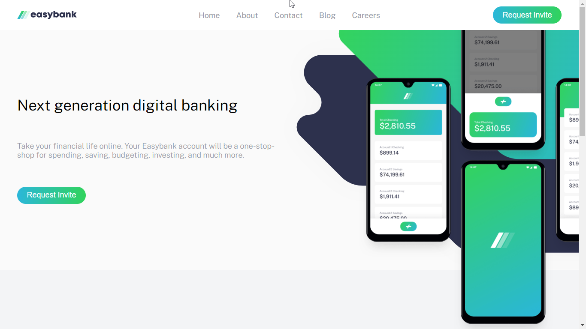

# Frontend Mentor - Easybank landing page solution

This is a solution to the [Easybank landing page challenge on Frontend Mentor](https://www.frontendmentor.io/challenges/easybank-landing-page-WaUhkoDN). Frontend Mentor challenges help you improve your coding skills by building realistic projects. 

## Table of contents

- [Overview](#overview)
  - [The challenge](#the-challenge)
  - [Screenshot](#screenshot)
- [My process](#my-process)
  - [Built with](#built-with)
- [Author](#author)

## Overview

### The challenge

Users should be able to:

- View the optimal layout for the site depending on their device's screen size
- See hover states for all interactive elements on the page

### Screenshot

### Links

- Source Code: [Source Code](https://github.com/Dezynre/easy_bank_landing_page)
- Live Site: [View Live Site](https://dezynre.github.io/easy_bank_landing_page/)

## My process

### Built with

- Semantic HTML5 markup
- CSS custom properties
- Flexbox
- CSS Grid
- Vanilla JavaScript

## Author

- Website - [Chacha Ian](https://github.com/Dezynre)
- Frontend Mentor - [@Dezynre](https://www.frontendmentor.io/profile/Dezynre)
- Twitter - [@ExpertChurcher](https://www.twitter.com/ExpertChurcher)
